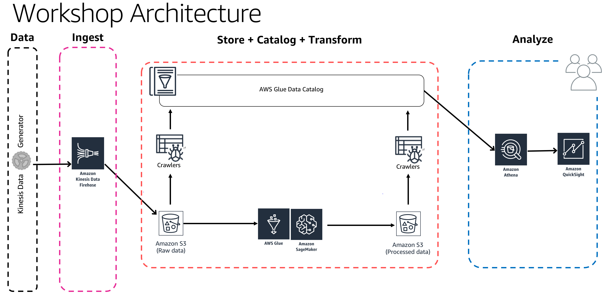

# Building Serverless Data Lakes on AWS
Author: Oshik Avioz | Chief Technology | Data & AI | AllCloud | [Linkedin](https://www.linkedin.com/in/oshikavioz/)



### What you will learn from this workshop?
* How to design serverless data lake architecture
* How to build a data processing pipeline and Data Lake using Amazon S3 for storing data
* Using Amazon Kinesis/MSK for real-time streaming data
* Using AWS Glue to automatically catalog datasets
* How to run interactive ETL scripts in an Amazon SageMaker Jupyter notebook connected to an AWS Glue development endpoint
* Run queries data using Amazon Athena & visualize it using Amazon QuickSight

# Workshop Requirements
* AWS account with **AdminstratorAccess**
* This workshop should be run in **us-east-1** region
* I recommend to **follow links from this  guide** & open them **in new a tab**
* You can run this workshop in Microsoft Edge or Google Chrome or Firefox

# Phase 1: Ingest and Store

## Create S3 Bucket

In this step, we will create S3 bucket used throughout this workshop.

Login to AWS Console: https://console.aws.amazon.com/console/home?region=us-east-1

Navigate to S3 Console and create a new bucket in us-east-1 region :

* GoTo : https://s3.console.aws.amazon.com/s3/home?region=us-east-1
* Click - **Create Bucket**
    * Bucket Name : **datalake-bucket-webinar**
    * Region : **US EAST (N. Virginia)**
    * Click **Create** (bottom left)
* Adding reference data
    * Open - **datalake-bucket-webinar**
        * Click - **Create folder**
            * New folder called : **data**
            * Click - **Save**
    * Open - **data**
        * Click - **Create folder**
            * New folder : **normalize_data**
            * Click - **Save**
    * Open - **normalize_data**
        * download this file locally : [tracking-data.json](tracking-data.json)
        * Click - Upload
            * Click **Add files** & upload the **tracking-data.json** file here
            * Click **Upload** (bottom left)


## Create Kinesis Firehose

In this step we will create Kinesis Firehose delivery stream to ingest data & store in S3:

* GoTo: https://console.aws.amazon.com/kinesis/home?region=us-east-1#/get-started
* Click **Create Delivery Stream**
    * Step 1: Name and source
        * Delivery stream name : **kns-dls-webinar-demo-stream**
        * Source : **Direct PUT or other sources**
        * Click **Next**
    * Step 2: Transform records
        * Record transformation : Disabled
        * Record format conversion: Disabled
        * Click **Next**
    * Step 3: Choose destination
        * Destination : **Amazon S3**
        * S3 bucket : **datalake-bucket-webinar**
        * Prefix : **data/raw/**  (slash **/** after **raw** is important, if you miss it Firehose will copy the data in an unknown location)
        * Error prefix : Leave Blank
        * Click **Next**
    * Step 4: Configure settings
        * S3 buffer conditions: Buffer size: **1** (MB)
        * S3 buffer conditions:  Buffer interval: **60** (sec)
        * S3 compression : **Disabled**
        * S3 encryption : **Disabled**
        * Error logging : **Enabled**
        * Leave everything else default
        * IAM role : Click on **Create new, or Choose**
            * Open a new window, leave everything to default
            * Click - **Allow**
        * Click - **Next**
    * Step 5: Review
        * Review the configuration & make sure its as mentioned above
        * Click - **Create delivery stream**


## Generate Fake Data

In this step we will configure Kinesis Data Generator to generate and produce fake data and ingest it into Kinesis Firehose

* **Configure Amazon Cognito** for Kinesis Data Generator - In this step we will launch a cloud formation stack that will configure Cognito. This cloudformation scripts launches in **Oregon region** (No need to change this region)
    * Goto : https://console.aws.amazon.com/cloudformation/home?region=us-west-2#/stacks/new?stackName=Kinesis-Data-Generator-Cognito-User&templateURL=https://s3-us-west-2.amazonaws.com/kinesis-helpers/cognito-setup.json
    * Click - **Next**
    * Specify Details:
        * Username - **admin**
        * Password - **choose a alphanumeric password**
        * Click - **Next**
    * Options:
        * Click - **Next**
    * Review:
        * Scroll down
        * I acknowledge that AWS CloudFormation might create IAM resources: **Check**
        * Click - **Create**
    * Refresh your AWS Cloudformation Console
    * Wait till the stack status changes to **Create_Complete**
        * Select the **Kinesis-Data-Generator-Cognito-User **stack
        * GoTo outputs tab : click on the link that says: **KinesisDataGeneratorUrl** - This will open your Kinesis Data Generator tool
* On Amazon Kinesis Data Generator homepage
    * **Login** with your username & password from previous step
    * **Region: us-east-1**
    * **Stream/delivery stream : kns-dls-webinar-demo-stream**
    * Records per second : 2000
    * **Record template  : **In the **big text area**, add the following json template
    * Click - **Send Data - do not click without pasting the below bit of template in the big text area**

Once the tools send ~ 100,000 messages, you can click on - **Stop sending data to Kinesis**

```

{
  "uuid": "{{random.uuid}}",
  "device_ts": "{{date.utc("YYYY-MM-DD HH:mm:ss.SSS")}}",
  "device_id": {{random.number(50)}},
  "device_temp": {{random.weightedArrayElement(
    {"weights":[0.30, 0.30, 0.20, 0.20],"data":[32, 34, 28, 40]}
  )}},
  "track_id": {{random.number(30)}},  
  "activity_type": {{random.weightedArrayElement(
        {
            "weights": [0.1, 0.2, 0.2, 0.3, 0.2],
            "data": ["\"Running\"", "\"Working\"", "\"Walking\"", "\"Traveling\"", "\"Sitting\""]
        }
    )}}
}

```

## Make sure that the fake data ingested into S3

After few moments GoTo S3 console:https://s3.console.aws.amazon.com/s3/home?region=us-east-1

* Click - **datalake-bucket-webinar > Data**
* There should be a folder called **raw** created > Open it and keep navigating, you will notice that firehose has dumped the data in S3 using **yyyy/mm/dd/hh** partitioning 

# Phase 2 : Create Data Catalog

## Create IAM Role

In this step we will navigate to IAM Console & create a new Glue service role, this allows AWS Glue to access data sitting in S3 and create necessary entities in Glue catalog.

* GoTo: https://console.aws.amazon.com/iam/home?region=us-east-1#/roles
* Click - **Create role**
    * Choose the service that will use this role: **Glue**
    * Click - **Next: Permissions**
    * Search for - **AmazonS3FullAccess**
        * Select **Checkbox**
    * Search for - **AWSGlueServiceRole**
        * Select **Checkbox**
    * Click - **Next: Tags**
	    * Leave as default, no changes here
    * Click - **Next: Review**
    * Role name: **WebinarAWSGlueServiceRole**
    * make sure that are two policies attached to this role (**AmazonS3FullAccess**, **AWSGlueServiceRole**)
    * Click - **Create role**


## Create AWS Glue Crawlers 

In this step, we will navigate to AWS Glue Console & create glue crawlers to discovery the newly ingested data in S3.

* GoTo: https://console.aws.amazon.com/glue/home?region=us-east-1
* On the left panel, click on **Crawlers** > Click on **Add Crawler**
    * Crawler info
        * Crawler name: **workshopcrawler**
        * Click - **Next**
    * Data store
        * Data store: **S3**
        * Crawl data in: **Specified path in my account**
        * Include path: **s3://datalake-bucket-webinar/data/**
        * Click - **Next**
        * Add another data store : **No**
        * Click - **Next**
    * IAM Role
        * Choose: **Create an IAM role**
        * Role Name: **WebinarAWSGlueServiceRole**
        * Click - **Next**
    * Schedule
        * Frequency: **Run on demand**
        * Click - **Next**
    * Output
        * Click - Add database
        * Database name: **workshopdb**
        * Click - **Create**
        * Click - **Next**
    * Review all steps
        * Review the configuration & make sure its as mentioned above
        * Click - **Finish**
* You should see a message : Crawler workshopcrawler was created to run on demand.
    * Click - **Run on demand** This will run the crawler
    * Wait for few minutes

## Verify newly created tables in catalog

GoTo Glue Catalog & explore the crawled data:

* GoTo : https://console.aws.amazon.com/glue/home?region=us-east-1#catalog:tab=databases 
    * Click - **workshopdb**
* Click - **Tables in workshopdb**
    * Click - **raw**
    * Look around and explore the schema for your dataset
        * Please see `averageRecordSize`, `recordCount`, `compressionType`

## Query ingested data using Amazon Athena

Now we will query newly ingested data using Amazon Athena

* GoTo : https://us-east-1.console.aws.amazon.com/athena/home?region=us-east-1#query
* On the left panel (**Database**) drop down , select **workshopdb** > select table **raw**
* Click on **3 dots** (3 vertical dots) > Select **Preview Table**
* Review the output 
* In query editor, paste the following query > Click on **Run Query**

```
SELECT activity_type,
         count(activity_type)
FROM raw
GROUP BY  activity_type
ORDER BY  activity_type
```


# Phase 3 : Data Transformation

## Create Glue Development Endpoint
In this step we will creating a develop Glue ETL endpoint scripts using PySpark

* GoTo : https://console.aws.amazon.com/glue/home?region=us-east-1#etl:tab=devEndpoints
* Click - **Add endpoint**
  * Development endpoint name - **devendpoint1**
    * IAM role - **WebinarAWSGlueServiceRole**
    * Expand - **Security configuration.. parameters**
      * DPUs - Data processing units: **2** (this affects the cost of the running this workshop)
  * Click - **Next**
  * Networking screen :
    * Choose - **Skip networking information**
  * Add an SSH public key (Optional)
    * Leave as defaults
    * Click: **Next**
  * Review the settings
    * Click: **Finish**

It will take close to 10 mins for the new Glue console to spin up.
Wait till Provisioning status is "READY"

You have to wait for this step to complete before moving to next step.

## Create SageMaker Notebooks (Jupyter) for Glue Dev Endpoints

* GoTo: https://console.aws.amazon.com/glue/home?region=us-east-1#etl:tab=notebooks
* Select tab : **Sagemaker notebooks**
* Click: **Create notebook**
  * Notebook name: **notebook1**
  * Attach to development endpoint: **devendpoint1**
  * Choose: **Create an IAM role**
  * IAM Role: **notebook1**
  * VPC (optional): Leave blank
  * Encryption key (optional): Leave blank
  * Click: **Create Notebook**

This will take few minutes, wait for this to finish

## Launch Jupyter Notebook
- Download and save this file locally on your laptop : [workshop-datalake-notebook.ipynb](workshop-datalake-notebook.ipynb)
- GoTo: https://console.aws.amazon.com/glue/home?region=us-east-1#etl:tab=notebooks
- Click - **aws-glue-notebook1**
- Click - **Open**, This will open a new tab
- On Sagemaker Jupyter Notebook 
  - Click - Upload (right top part of screen)
  - Browse and upload **workshop-datalake-notebook.ipynb** which you downloaded earlier
  - Click - **Upload** to confirm the download
  - Click on **workshop-datalake-notebook.ipynb ** to open the notebook
  - Make sure it says **'Sparkmagic (PySpark)'** on top right part of the notebook, this is the name of the kernel Jupyter will use to execute code blocks in this notebook


**Follow the instructions on the notebook**
	  - Read and understand the instructions, they explain important Glue concepts

## Validate - Transformed / Processed data has arrived in S3

Once the ETL script has ran successfully.
console:https://s3.console.aws.amazon.com/s3/home?region=us-east-1

* Click - **datalake-bucket-webinar > data**
* There should be a folder called **aggregated-data** created here > Open it & ensure that .parquet files are created in this folder.

# Phase 4 : Analyze Data

## Explore transformed data using Athena

In this step we will analyze the transformed data using Athena 

Login to the Amazon Athena Console.

* GoTo: https://console.aws.amazon.com/athena/home?region=us-east-1#query
* As Athena uses the AWS Glue catalog for keeping track of data source, any S3 backed table in Glue will be visible to Athena.
* On the left panel, select '**workshopdb**' from the dropdown
* Run the following query : 

```
SELECT artist_name,
         count(artist_name) AS count
FROM processed_data
GROUP BY  artist_name
ORDER BY  count desc
```

* Explore the Athena UI and try running some queries
* This query returns the list of tracks repeatedly played by devices , we will later visualize this using QuickSight

````
SELECT device_id,
         track_name,
         count(track_name) AS count
FROM processed_data
GROUP BY  device_id, track_name
ORDER BY  count desc
````


# Part 5: Visualize Data

## Setting Up QuickSight
In this step we will create a visualization it using QuickSight

Login to Amazon QuickSight Console and complete the registration and signup

* GoTo: https://us-east-1.quicksight.aws.amazon.com/sn/start
* You should see quicksight dashboard: 


## Configure QuickSight Permissions

* GoTo: https://us-east-1.quicksight.aws.amazon.com/sn/console/resources?#
* Select: **Amazon Athena**  - this enables QuickSight access to Amazon Athena databases
* Select: **Amazon S3**
	* Select: **datalake-bucket-webinar**
	* Click: **Select buckets**
* Click: **Update**


## Adding a New Dataset

* GoTo: https://us-east-1.quicksight.aws.amazon.com/sn/start
* On top right, Click - **Manage Data**
    * Click - **New Data Set**
    * Click - **Athena** 
    * New Athena data source
        * Data source name: **workshopdemo**
        * Click - Validate Connection 
            * This will check if your QuickSight can access Athena
            * If validation fails - click on your username on top-right > 
        * Click - **Create data source**
    * Choose your table:
        * Database: contain sets of tables: select - **workshopdb**
        * Tables: contain the data you can visualize : select - **processed_data**
        * Click - **Select**
    * Finish data set creation:
        * Select - **Directly query your data**
        * Click **Visualize**


## Using Amazon QuickSight to Visualize Our Processed Data

###  Visualization 1: Heat map visualization type for users and tracks they are listening to

Here we will create a visualization that show which users are listening to repetitive tracks

* On the bottom-left panel - **Visual types**
    * Hover on icon there to see names of the visualizations
    * Click on - **Heat Map**
* On top-left panel - **Fields list**
    * Click -  **device_id**
    * Click - **track_name**
* Just above the visualization you should see **Field wells** : [**Rows - device_id**] [**Columns - track_name**]

If you hover on dark blue patches on the heatmap you will see that those particular users are listening to same track repeatedly.


### Visualization 2: Tree map visualization type for using the of most played by Artist Names

In this step we will create a visualization that shows who are the host played artists

* On top-left - Click on '**+ Add**' > **Add Visual**, this will add a new panel to the right pane
* On the bottom-left panel - **Visual types**
    * Hover on icon there to see names of the visualizations
    * Click on - **Tree Map**
* On top-left panel - **Fields list**
    * Click - **artist_name**

Play around and explore Amazon QuickSight Console. NOw try filtering, more options of visualization types, etc.


# Deployment CleanUp

Pay attention of failing to do this will result in incuring AWS usage charges.

Pleased make sure you bring down and deleting all resources created as part of this workshop

## Resources to delete
* Kinesis Firehose Delivery Stream
	* GoTo: https://console.aws.amazon.com/firehose/home?region=us-east-1#/
	* Delete Firehose:  **kns-dls-webinar-demo-stream**
* Glue Database
	* GoTo: https://console.aws.amazon.com/glue/home?region=us-east-1#catalog:tab=databases
	* Delete Database: **workshopdb**
* Glue Crawler
	* GoTo: https://console.aws.amazon.com/glue/home?region=us-east-1#catalog:tab=crawlers
	* Delete Crawler: **workshopcrawler**
* Glue Dev Endpoint
	* GoTo: https://console.aws.amazon.com/glue/home?region=us-east-1#etl:tab=devEndpoints
	* Delete endpoint: **webinar-devendpoint**
* Sagemaker Notebook
	* You may wish you download the notebook file locally on your laptop before deleting the notebook)
	* GoTo: https://console.aws.amazon.com/glue/home?region=us-east-1#etl:tab=notebooks
	* Delete Notebook: **aws-glue-webinar-notebook**
* Delete IAM Role
	* GoTo: https://console.aws.amazon.com/iam/home?region=us-east-1#/roles
	* Search for WebinarAWSGlueServiceRole
	* Delete Role: **WebinarAWSGlueServiceRole**
* Delete S3 bucket
	* GoTo: https://s3.console.aws.amazon.com/s3/home?region=us-east-1
	* Delete Bucket: **your bucket name **
* Delete Cognito Setup :
	* Goto: https://us-west-2.console.aws.amazon.com/cloudformation/home?region=us-west-2#/stacks/
	* Click: **Kinesis-Data-Generator-Cognito-User**
	* Click: **Actions** > **DeleteStack**
	* On confirmation screen: Click: **Delete**
* Close QuickSight account
	* GoTo: https://us-east-1.quicksight.aws.amazon.com/sn/admin#permissions
	* Click: **Unsubscribe**
* Cognito Userpool
	* GoTo: https://us-west-2.console.aws.amazon.com/cognito/users/?region=us-west-2#/


# Thank You! :-)
